# Ranqia Labs

 

When someone asks AI about your category — do you appear?

 

Ranqia tracks your brand across ChatGPT, Perplexity, and Google AI. 
Not keywords. Not clicks. **Answers.**

 

 

---

 

`visibility` &nbsp;·&nbsp; `sentiment` &nbsp;·&nbsp; `competitive position` &nbsp;·&nbsp; `trend`

 

---

 

AI search is the new front page. 
Most brands don't know if they're on it.

 

